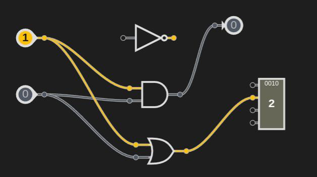

# Logic Gates Simulator

Provides a simple and intuitive way to create and simulate logic gates.

## Features

- [ ] Create and edit logic gates
- [ ] Connect logic gates
- [ ] Simulate logic gates

# Demo

Live Demo at [logicSim.bosc.org.np](https://logicsim.bosc.org.np)

<!-- gif demo here when partly ready -->

# Installation and Development

Raw HTML, CSS, and JS are used to build this project. No build tools are used.

```bash
git clone [url]
cd logicSim
open index.html # or double click or drag and drop to browser
```

# Contributing

Contributions are welcome. Please create an [issue](.github/ISSUE_TEMPLATE/custom.md) or [pull request](./docs/pull_request_template.md) with their templates. View the [CONTRIBUTING.md](./CONTRIBUTING.md) for more details.

> You can open valid issues as you like following the issue template. PRs are welcome for issues only. Do not open PRs without issues.

# Code of Conduct

This project and everyone participating in it is governed by the [Code of Conduct](./CODE_OF_CONDUCT.md).

# License

This project is licensed under the GNU General Public License v3.0 - see the [LICENSE](./LICENSE) file for details.

<!--
references:
https://github.com/jppellet/Logic-Circuit-Simulator (best but in ts, not static)

https://github.com/drendog/Logic-Circuit-Simulator (static in js, not worthy)
https://github.com/saliherdemk/Logic-Circuit-Simulator (static in js, not worthy)

https://github.com/vassbo/logic (different but great, static, implementable)
 -->
